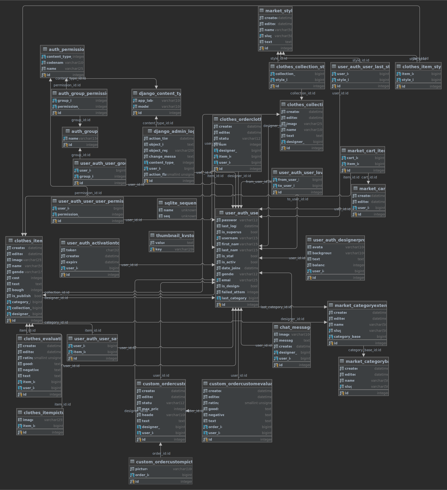

# Pipeline status
-  - main
-  - develop

# Django model dependency

# code features
> - we are used mypy, pylint, isort, black and flake8 in code writing
> - all functions are type hinted and all modules too
> - we have custom authentication backend and context processors
> - project is not ended, we had little time to create this very good
> - we want to create service for designers who customizing clothes
> - we want to localize site and add some technical features

# How to run it on windows
0. Download Python 3.10.0 https://www.python.org/downloads/release/python-3100/
1. Clone this repo and prepare workplace
> - git clone https://github.com/J3olchara/stylehub
> - cd yandex-team
> - python -m venv venv
> - venv\scripts\activate

2. Download application dependencies:
> - if you want to make some tests you need to run:
>
> python -m pip install -r requirements\test.txt
> - if you want to develop some features you need to run:
> 
> python -m pip install -r requirements\dev.txt
>
> - or if you want to run it in production you need to run:
>
> python -m pip install -r requirements\prod.txt

 - install GNU tools from https://mlocati.github.io/articles/gettext-iconv-windows.html

3. Get a secret variables for your application:
  > create .env file with example.env variables. 

Prevent third parties from getting values of your .env variables

4. Migrate database:
  > python stylehub\manage.py makemigrations
  > 
  > python stylehub\manage.py migrate

5. Create your admin account:
  > python stylehub\manage.py createsuperuser
> - write your login
> - write your email
> - write your password
> - confirm the password

6. Load fixtures
 > python stylehub\manage.py loaddata fixtues\save.json

7. finally run it by this command:
> python stylehub\manage.py runserver

Then the application will start on http://localhost:8000

# How to run in on Linux OS

1. Clone this repo and prepare workplace
  > - git clone https://github.com/J3olchara/yandex-team
  > - cd yandex-team
  > - python3 -m venv venv
  > - venv/bin/activate

2. Download application dependencies:
  > - if you want to make some tests you need to run:
  >
  > python3 -m pip3 install -r requirements/test.txt
  > python3 -m pip3 install -r requirements/dev.txt
  > - if you want to develop some features you need to run:
  > 
  > python3 -m pip3 install -r requirements/dev.txt
  >
  > - or if you want to run it in production you need to run:
  >
  > python3 -m pip3 install -r requirements/prod.txt

> sudo apt-get install gettext

3. Get a secret variables for your application:
  > create .env file with example.env variables. 

Prevent third parties from getting values of your .env variables

4. Migrate database: 
  > python3 stylehub/manage.py migrate

5. Create your admin account:
  > python3 stylehub/manage.py createsuperuser
> - write your login
> - write your email
> - write your password
> - confirm the password

6. Load fixtures
 > python stylehub\manage.py loaddata fixtues\save.json

7. finally run it by this command:
> python stylehub\manage.py runserver

Then the application will start on http://localhost:8000
